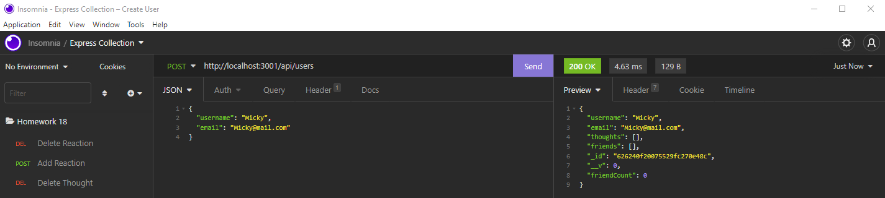
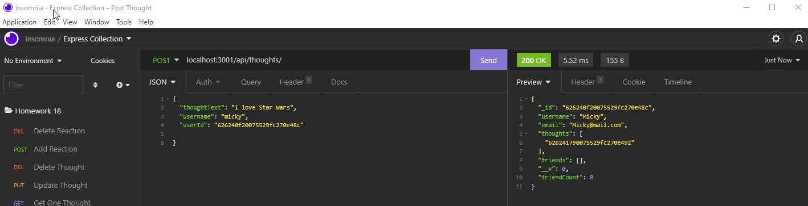

# Michael Ariti - Social Network API

[](https://opensource.org/licenses/MIT)

| Table of Contents                               |
| ----------------------------------------------- |
| [1. Description.](#description)                 |
| [2. User Story.](#user-story)                   |
| [3. Acceptance Criteria.](#acceptance-criteria) |
| [4. Installation.](#installation)               |
| [5. Usage.](#usage)                             |
| [6. License.](#license)                         |
| [7. Contributing.](#contributing)               |
| [8. Technologies Used.](#technologies-used)     |
| [9. Screenshot.](#screenshot)                   |
| [10. Video Walkthrough.](#video-walkthrough)    |
| [11. Questions.](#questions)                    |

## Description

The purpose of this repository is to create a Mongoose based API that interacts with MongoDB in the form of a basic social network.

### Features

```
The ability to create a user.
The ability to delete a user.
The ability to update a user.
The ability to view a user.
The ability to create thoughts.
The ability to delete thoughts.
The ability to update thoughts.
The ability to view thoughts.

```

## User Story

```md
AS A social media startup
I WANT an API for my social network that uses a NoSQL database
SO THAT my website can handle large amounts of unstructured data
```

## Acceptance Criteria

```md
GIVEN a social network API
WHEN I enter the command to invoke the application
THEN my server is started and the Mongoose models are synced to the MongoDB database
WHEN I open API GET routes in Insomnia for users and thoughts
THEN the data for each of these routes is displayed in a formatted JSON
WHEN I test API POST, PUT, and DELETE routes in Insomnia
THEN I am able to successfully create, update, and delete users and thoughts in my database
WHEN I test API POST and DELETE routes in Insomnia
THEN I am able to successfully create and delete reactions to thoughts and add and remove friends to a user’s friend list
```

## Installation

To install this app you are required to have MondoDB set up and configured. Open the server.js file in a node terminal and use the command `npm install` to install the dependencies. Run `npm start` to begin the app. To interact with it, it is recommended to use `Insomnia`

## Usage

To use this app run `server.js` and open local port 3001 in your browser.

## License

This project uses the MIT license.

## Contributing

If you would like to contribute to the project please message my github.

## Technologies Used

1. Javascript
2. Node.js
3. MongoDB
4. Mongoose
5. Express.js
6. Moment

## Screenshot





## Video Walkthrough

[URL](https://mickeytechblog.herokuapp.com/blog)

## Questions

If you have Questions or tips please email me at the address below.

### Email

MichaelAriti94@gmail.com

### End

Michael Ariti 2022
